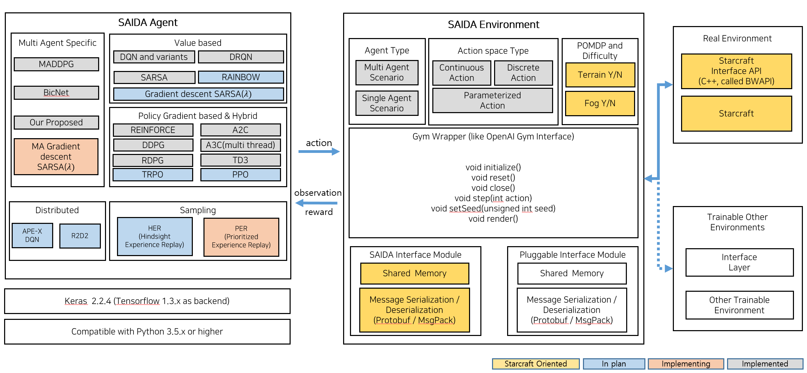

# SAIDA RL
Welcome to SAIDA RL! This is the open-source platform for anyone who interests in Starcraft I and reinforcement learning to play and evaluate your model and algorithms.

## Table of Contents

* [What is SAIDA RL?](#what-is-saida-rl)
* [Basic](#basics)
* [Installation](#installation)
	* [Prerequisites](#prerequisites)
* [Guide](#guide)
    * [Installation](#installation)
	* [Tutorials](#tutorials)
	* [API](#api)
* [Environment](#environment)
	* [Agent](#agent)
	* [Scenarios](#scenarios)
* [Working Examples](#working-examples)
* [Plan](#plan)
* [Reference](#references)

## What is SAIDA RL? 
It is a simulator for users to train and evaluate their own algorithms and models in challenging Starcraft I environment. It is not only provide simulator itself, but also provide tutorials, development api document. It is specialized in Starcraft I and provides many scenarios. You can taste very fresh and challenging game and you can try your own idea to make starcraft unit better. 

## Basics
Anyone who are familiar with reinforcement learning entities and how open ai gym works can skip this.  In reinforcement learning, there are  the environment and the agent. 
The agent sends actions to the environment, and the environment replies with observations and rewards. 

SAIDA RL __inherits interface of Env class of gym__ and provides baseline algorithms and agent source which is independent from Env.
But it is up to you whether to use these baseline sources. The following are the Env methods you should know:

| function | explanation | 
| --- | --- | 
| init(self) | Not used. |
| render(self) | Not used. |
| reset(self) | Reset the environment's state. Returns observation. |
| step(self, action) | Step the environment by one timestep. Returns observation, reward, done, info. |
| close(self) | Close connection with Starcraft. |

## Guide
You can access three documentations to run a agent in this environment.

### Installation
[Link](https://TeamSAIDA.github.io/SAIDA_RL/installation/)

### Tutorials
[Link](https://TeamSAIDA.github.io/SAIDA_RL/tutorial/)

### API
[Link](https://TeamSAIDA.github.io/SAIDA_RL/api/index.html)

## Environment
We built environment based on openai gym. it consists of interface like below. 

### Agent

Agent we provided is based on [keras-rl](https://github.com/keras-rl/keras-rl) which is one of top reinforcement learning framework commonly used and we upgraded it by oursevles to support more. But you can use your own agent if you want. We decoupled between agent and environment. there is no dependencies so that, it is compatible with any numerical computation library, such as TensorFlow or Theano. You can use it from Python code, and soon from other languages.  If you're not sure where to start, we recommend beginning with the [tutorials](https://TeamSAIDA.github.io/SAIDA_RL/tutorial/) on our site.

### Scenarios

We have various challenging scenarios for you to motivate trying to solve with reinforcement learning algorithms.

<table>
   <tr>
	   <th>Map Name</th>
	   <th>Env Name</th>
	   <th>Desc. </th>
	   <th>Terrain(Y/N) </th>
	   <th>Agent</th>
	   <th>Action space</th>
	   <th>Termination Condition</th>  
	</tr>
	<tr>
	   <td><a href="/SAIDA_RL/VultureVSZealot">Vul_VS_Zeal_v0 (~3)</a></td>
	   <td>VultureVsZealot</td>
	   <td>Combat scenario between Terran Vulture and Protoss Zealots</td>
	   <td>It depends on the version of map.</td>
	   <td>Vulture</td>
	   <td>Move to specific direction, Patrol to enemy(meaning attack)</td>
	   <td>Kill or dead</td>
	</tr>
	<tr>
	   <td><a href="/SAIDA_RL/AvoidObserver">Avoid_Observer_v0</a></td>
	   <td>AvoidObserver</td>
	   <td>Reach the top of map while avoiding observers in the middle area.</td>
	   <td>N</td>
	   <td>Scourge</td>
	   <td>Move to specific direction</td>
	   <td>Reach the goal or dead</td>
	</tr>
	<tr>
	   <td><a href="/SAIDA_RL/AvoidReavers">Avoid_Reaver_v0</a></td>
	   <td>AvoidReaver</td>
	   <td>Reach the right-bottom area of the map while avoiding reavers in the middle area. </td>
	   <td>N</td>
	   <td>DropShip</td>
	   <td>Move to specific direction</td>
	   <td>Reach the goal</td>
	</tr>
</table>

## Algorithms

we divided algorithms to three categories.  

### Value based

#### Before DQN

- [x] QLearning

- [x] SARSA

#### DQN with variants
- [x] DQN [[1]](http://arxiv.org/abs/1312.5602), [[2]](https://www.nature.com/articles/nature14236)

- [x] Dueling DQN [[9]](https://arxiv.org/abs/1511.06581)

- [x] Double DQN [[3]](http://arxiv.org/abs/1509.06461)

#### Deep Recurrent DQN

- [x] DRQN [[11]](https://arxiv.org/abs/1507.06527)

### Policy based

- [x] REINFORCE [[14]](http://www-anw.cs.umass.edu/~barto/courses/cs687/williams92simple.pdf)

- [ ] A2C

- [x] DDPG [[4]](http://arxiv.org/abs/1509.02971)

- [ ] RDPG

- [x] PPO [[11]](https://arxiv.org/abs/1707.06347)

### Multi Agent algorithms

- [x] MADQN

- [ ] TD Gradient Lambda

- [ ] MADDPG [[12]](https://arxiv.org/pdf/1706.02275.pdf)

- [ ] MARDPG

- [ ] BicNet [[13]](https://arxiv.org/pdf/1703.10069)

## Working Examples
Demos for well trained agents' play

### Grid World in Starcraft I  
for warming up, you can try this problem by yourselves.

### Avoid Observers 
Scurege's goal is to reach top area of current map avoiding conflict with observers surrounded
   

### Avoid Reavers
Reaver's goal is to reach bottom area of current map avoiding conflict with drop ship surrounded

### Vultures 1 vs Zealot 1
Battle between one vulture and one zealot. 

### Vultures 1 vs Zealot 2
Battle between one vulture and two zealot.

## Plan

- [ ] We will update more challenging scenarios.
- [ ] Multi Agent algorithms  

## References

1. *Playing Atari with Deep Reinforcement Learning*, Mnih et al., 2013
2. *Human-level control through deep reinforcement learning*, Mnih et al., 2015
3. *Deep Reinforcement Learning with Double Q-learning*, van Hasselt et al., 2015
4. *Continuous control with deep reinforcement learning*, Lillicrap et al., 2015
5. *Asynchronous Methods for Deep Reinforcement Learning*, Mnih et al., 2016
6. *Continuous Deep Q-Learning with Model-based Acceleration*, Gu et al., 2016
7. *Deep Reinforcement Learning (MLSS lecture notes)*, Schulman, 2016
8. *Dueling Network Architectures for Deep Reinforcement Learning*, Wang et al., 2016
9. *Reinforcement learning: An introduction*, Sutton and Barto, 2011
10. *Proximal Policy Optimization Algorithms*, Schulman et al., 2017
11. *Deep Recurrent Q-Learning for Partially Observable MDPs*, M. Hausknecht and P. Stone, 2015
12. *Multi-agent actor-critic for mixed cooperative-competitive environments*, Lowe, Ryan, et al., 2017
13. *Multiagent Bidirectionally-Coordinated Nets Emergence of Human-level Coordination in Learning to Play StarCraft Combat Games*, Peng et al., 2017
14. *Simple Statistical Gradient-Following Algorithms for Connectionist Reinforcement Learning*, William et al., 1992

